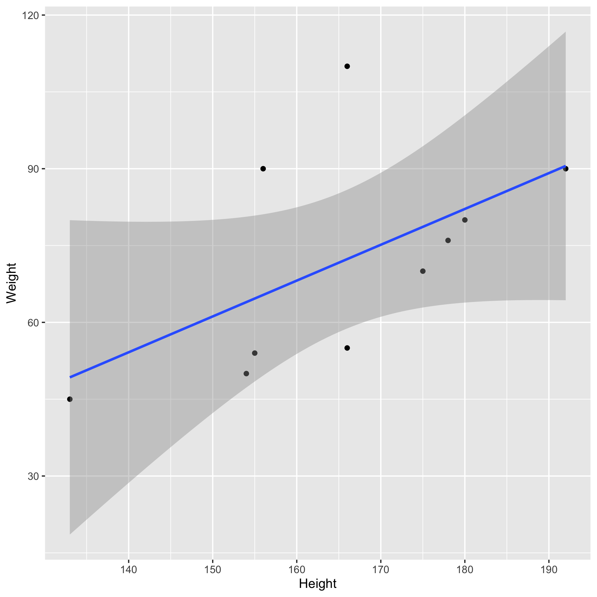

# Summary/Abstract
_Write a summary of your project._

# Illustrating setup
_This section is only there to show how to insert results from other places in the project and how to cite figures and other references. Delete this whole section at some point._


This paper [@Leek2015a] discusses types of analyses. 


Figure \@ref(fig:resultfigure) shows a result figure from the analysis.

```{r resultfigure,  fig.cap='Analysis figure.', echo=FALSE}

```

Table \@ref(tab:resulttable) shows a result table from the analysis.

```{r resulttable,  echo=FALSE}
resulttable=readRDS("../../results/resulttable.rds")
knitr::kable(resulttable, caption = 'Result Table.')
```


Note that this cited reference will show up at the end of the document, the reference formatting is determined by the CSL file specified in the YAML header. Many more style files for almost any journal [are available](https://www.zotero.org/styles). You also specify the location of your bibtex reference file in the YAML. You can call your reference file anything you like, I just used the generic word `references.bib` but giving it a more descriptive name is probably better.


# Introduction (required for part 1)

## General Background Information
_Provide enough background on your topic that others can understand the why and how of your analysis_ 
The majority of the surface of the influenza virion is composed of two glycoproteins: the hemaglutinin (HA) and the neuraminidase (NA). Upon vaccination the host responsed by producing neurtralizing antibodies targeting these surface proteins. Due to the high variablity and mutability of the HA, the influenza virus is able to undergo antigenic drift and evade vaccine induced protection. In the Ross lab, a cross-reactive HA protein vaccine has been developed. This computational HA (P1 COBRA HA) contains a broader set of antibody epitopes than wild-type HAs. To further investigate the difference between the epitopes displayed on the P1 and the wild-type A/California/07/2009 (CA/09) HA, monoclonal antibodies raised against each antigen were purified and are currently undergoing characterization. It was found that the P1-specific antibodies bound to a wider range of human isolated influenza viruses, whereas the CA/09 antibodies were more narrow. However, influenza is also isolated from swine hosts, and swine influenza sequences were used in the design of the P1 COBRA HA immunogen. Therefore, the P1-specific antibodies may bind to more wild-type swine influenza HAs than CA/09 antibodies. The impact of a cross-species influenza vaccine is useful for animal-workers as well as prevention of a future pandemic. 

## Description of data and data source
_Describe what the data is, what it contains, where it is from, etc._
The data contains 1.) the minimum hemagglutination inhibtion concentration of each purified monoclonal antibody from CA/09 or P1 COBRA, 2.) the hemagglutination inhibtion titer of the polyclonal sera from the mice that the monoclonal antibodies were purifed from, 3.) the HAs being tested are different swine influenza H1 viruses. There are 19 different swine viruses. There are 12 P1 Mabs, 18 CA09 Mabs, 6 polyclonal sera from CA09 mice, and 10 polyclonal sera from P1 mice. 

I have generated the minimum inhibitory concentration data and the HAI titer data. The other data is classification data. The post-doc (Giuseppe) has determined the binding locations of the antibodies and whether they compete for similar epitope regions. Furthermore the swine viruses that are being tested for being inhibited can be categorized into different genetic lineages. 


## Questions/Hypotheses to be addressed
_State the research questions you plan to answer with this analysis_
Monoclonal antibodies raised against P1 COBRA HA immunogen show a wider-breadth hemagglutinin inhibtion among different influenza viruses than monoclonal antibodies raised against CA/09 HA. Furthermore, the minimum hemagglutin inhibition concentration of the antibodies is less than those elicited by CA/09. 

We have data about the differences where the antibodies bind. This data may be added in order to see if antibodies that fall into the category of 1. Bind to P1, 2.)Do not bind to human influenza, and 3.) bind to Swine influenza. I want to analyze the data by looking at the total number of viruses that the monoclonals inhibit the HA of. Then look at whether those viruses are the same ones being inhibited every across different monoclonals. Then I want to compare across P1 and CA/09 to see if P1 inhibits more than CA09. Then to see if the ones being inhibited by P1 are the same ones by CA09 and if there is any overlap. Then I want to look at if the viruses being inihibted are specific to a lineage. Finally, the monoclonal antibody inhibition in a concentration so I can look at overall if less antibody is needed for a specific virus that is inhibited by both.  


# Methods and Results

_In most research papers, results and methods are separate. You can combine them here if you find it easier. You are also welcome to structure things such that those are separate sections._


## Data aquisition
_As applicable, explain where and how you got the data. If you directly import the data from an online source, you can combine this section with the next._
I have an excel file of the data that I've been keeping track of the results. I have imported it. 

## Data import and cleaning
_Write code that reads in the file and cleans it so it's ready for analysis. Since this will be fairly long code for most datasets, it might be a good idea to have it in one or several R scripts. If that is the case, explain here briefly what each file does. The files themselves should be commented well so everyone can follow along._

## Univariate analysis
_Use a combination of text/tables/figures to explore and describe your data. You should produce plots or tables or other summary quantities for most of your variables. You definitely need to do it for the important variables, i.e. if you have main exposure or outcome variables, those need to be explored. Depending on the total number of variables in your dataset, explore all or some of the others._

## Bivariate analysis
_Create plots or tables and compute simple statistics (e.g. t-tests, simple regression model with 1 predictor, etc.) to look for associations between your outcome(s) and each individual predictor variable_


## Full analysis
_Use one or several suitable statistical/machine learning methods to analyze your data and to produce meaningful figures, tables, etc. This might again be code that is best placed in one or several separate R scripts that need to be well documented. You can then load the results produced by this code_

# Discussion

## Summary and Interpretation
_Summarize what you did, what you found and what it means._

## Strengths and Limitations
_Discuss what you perceive as strengths and limitations of your analysis._

## Conclusions
_What are the main take-home messages?_


_Include citations in your Rmd file using bibtex, the list of references will automatically be placed at the end_

# References

