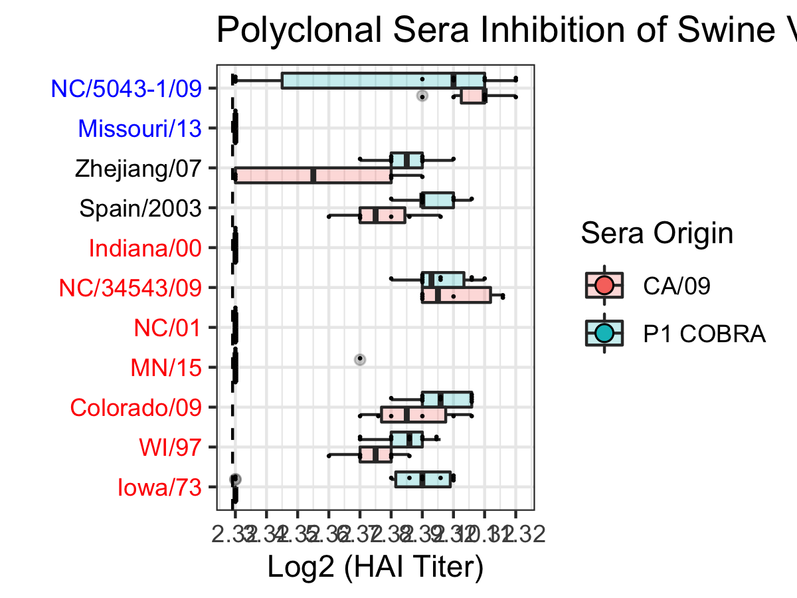

```{r echo = FALSE}
library(here)

```


# Summary/Abstract
_Write a summary of your project._

# Introduction

The majority of the surface of the influenza virion is composed of two glycoproteins: the hemaglutinin (HA) and the neuraminidase (NA). Upon vaccination the host responsed by producing neurtralizing antibodies targeting these surface proteins. Due to the high variablity and mutability of the HA, the influenza virus is able to undergo antigenic drift and evade vaccine induced protection. In the Ross lab, a cross-reactive HA protein vaccine has been developed. This computational HA (P1 COBRA HA) contains a broader set of antibody epitopes than wild-type HAs. To further investigate the difference between the epitopes displayed on the P1 and the wild-type A/California/07/2009 (CA/09) HA, monoclonal antibodies raised against each antigen were purified and are currently undergoing characterization. It was found that the P1-specific antibodies bound to a wider range of human isolated influenza viruses, whereas the CA/09 antibodies were more narrow. However, influenza is also isolated from swine hosts, and swine influenza sequences were used in the design of the P1 COBRA HA immunogen. Therefore, the P1-specific antibodies may bind to more wild-type swine influenza HAs than CA/09 antibodies. The impact of a cross-species influenza vaccine is useful for animal-workers as well as prevention of a future pandemic. 

The data contains 1.) the minimum hemagglutination inhibtion concentration of each purified monoclonal antibody from CA/09 or P1 COBRA, 2.) the hemagglutination inhibtion titer of the polyclonal sera from the mice that the monoclonal antibodies were purifed from, 3.) the HAs being tested are different swine influenza H1 viruses. There are 19 different swine viruses. There are 12 P1 Mabs, 18 CA/09 Mabs, 6 polyclonal sera from CA/09 mice, and 10 polyclonal sera from P1 mice. 

I have generated the minimum inhibitory concentration data and the HAI titer data. The other data is classification data. The post-doc (Giuseppe) has determined the binding locations of the antibodies and whether they compete for similar epitope regions. Furthermore the swine viruses that are being tested for being inhibited can be categorized into different genetic lineages. 


## Questions/Hypotheses to be addressed
_State the research questions you plan to answer with this analysis_
Monoclonal antibodies raised against P1 COBRA HA immunogen show a wider-breadth hemagglutinin inhibtion among different influenza viruses than monoclonal antibodies raised against CA/09 HA. Furthermore, the minimum hemagglutin inhibition concentration of the antibodies is less than those elicited by CA/09. 

We have data about the differences where the antibodies bind. This data may be added in order to see if antibodies that fall into the category of 1. Bind to P1, 2.)Do not bind to human influenza, and 3.) bind to Swine influenza. I want to analyze the data by looking at the total number of viruses that the monoclonals inhibit the HA of. Then look at whether those viruses are the same ones being inhibited every across different monoclonals. Then I want to compare across P1 and CA/09 to see if P1 inhibits more than CA09. Then to see if the ones being inhibited by P1 are the same ones by CA09 and if there is any overlap. Then I want to look at if the viruses being inihibted are specific to a lineage. Finally, the monoclonal antibody inhibition in a concentration so I can look at overall if less antibody is needed for a specific virus that is inhibited by both.  


# Material and Methods
#### Monoclonal Antibody Production
The monoclonal antibodies used for the assays are described in Table 1. 

```{r resulttable1,  fig.cap='Table1.', echo=FALSE}

```


#### Viruses and HA antigens
H1 viruses were obtained through the Influenza Reagents Resource (IRR), BEI Resources, the Centers for Disease Control (CDC), Sanofi-Pasteur, or the Tompkins Laboratory.  Viruses were passaged once in the same growth conditions as they were received or as per the instructions provided by the WHO or the University of Minnesota, in either embryonated chicken eggs or Madin-Darby canine kidney (MDCK) cell culture [1].  Virus lots were aliquoted for single-use applications and stored at -80°C. Hemagglutination titer of the frozen aliquots was determined with turkey RBCs. 

The classification of the swine HA was determined using the Swine H1 Clade Classification Tool (http://www.fludb.org) [2] and infers both the global [2] and US [3, 4] swine H1 clade classification from the HA nucleotide sequence.  When available, virus was used for HAI assays, otherwise virus-like particles (VLP) were used. The protein accession numbers for the HA amino acid sequences used for virus-like particle production are provided. The CDS of the wild-type HAs were codon optimized for expression in human cells.   

Swine wild-type HAs were chosen to be representative of the different lineages and clades described in Table 2. 

```{r resulttable2,  fig.cap='resulttable2.', echo=FALSE}

```


#### Virus-like Particle (VLP) preparation

Human embryonic kidney 293T (HEK-293T) cells (1 x 10^6 cells total) were transiently transfected with 1 μg DNA of each of the three pTR600 mammalian expression vectors [5; REF] one of each expressing the influenza neuraminidase (A/Mallard/Alberta/24/2001; H7N3), the HIV p55 Gag sequence, and one of the various H1 wild-type hemagglutinins.  Following 72 h of incubation at 37°C in serum free medium, transiently transfected cell supernatent was collected, centrifuged to remove cellular debris, and filtered through a 0.22 μm pore membrane.  Virus-like particles (VLPs) were purified and sedimented by ultracentrifugation on a 20% glycerol cushion at 135,000 x g for 4 h at 4°C.  VLPs were resuspended in phosphate buffered saline (PBS), and total protein concentration was determined with the Micro BCA Protein Assay Reagent kit (Pierce Biotechnology, Rockford, IL, USA).  Hemagglutination activity (HA) of each preparation of VLP was determined by serially diluting volumes of VLPs and adding equal volume 0.8% turkey red blood cells (RBCs) (Lampire Biologicals, Pipersville, PA, USA) suspended in PBS to a V-bottom 96-well plate with a 30 min incubation at room temperature (RT). Prepared RBCs were stored at 4°C and used within 72 h. The highest dilution of VLP with full agglutination of RBCs was considered the endpoint HA titer.  

#### Hemagglutination inhibition (HAI) assay

The hemagglutination inhibition (HAI) assay assessed functional antibodies specific to the HA able to inhibit agglutination of turkey erythrocytes. The protocol is adapted from the WHO laboratory influenza surveillance manual [1; REF]. HAIs were conducted with either polyclonal mouse sera or purified monoclonal antibodies. Polyclonal sera were treated with receptor-destroying enzyme (RDE) (Denka Seiken, Co., Japan) prior to being tested to inactivate nonspecific inhibitors.  Briefly, three parts RDE were added to one part sera and incubated overnight at 37°C. RDE was inactivated by incubation at 56°C for ∼30 min. After heat treatment, six parts PBS were added to the RDE-treated sera. Purified monoclonal antibodies were adjusted to a concentration of 20 μg/ml in PBS. 

RDE-treated and monoclonal antibodies were added in 50 μl to a V-bottom microtiter plate and were two-fold serially diluted across in PBS. An equal volume, 25 μl, of each virus (or VLP where applicable), adjusted to approximately 8 hemagglutination units (HAU)/50 μl, was added to all wells except for the last column which received 25 μl of PBS. The plates were covered and incubated at RT for 20 min. Then, 50 μl of 0.8% turkey red blood cells were added to each well. The plates were mixed by agitation and covered, and the RBCs were allowed to settle for 30 min at RT. The polyclonal sera HAI titer was determined by the reciprocal dilution of the last well that contained non-agglutinated RBCs. The monoclonal minimum agglutination concentration was determined by the dilution of the last well that contained non-agglutinated RBCs multiplied by the starting concentration of 20 μg/ml. Negative controls were included for each plate.All mice were negative (HAI < 1:10) for preexisting antibodies to currently circulating human and swine influenza viruses prior to vaccination.


#### Cell-based ELISA for Influenza Neutralization

#### Statistical Analysis
The limit of detection for the polyclonal sera HAI was 1:10, and 1:5 was used for the statistical analysis of samples below that. The limit of detection for the monoclonal antibody HAI was 10 ug/ml. Samples below that limit were defined as 20ug/ml for statistical analysis. The log2 geometric mean was calculated from the HAI titers of the polyclonal sera and monoclonal antibody concentrations. 


# Results

The data was imported from the raw excel data file along with the antigen and antibody keys. 

Due to a limited supply of polyclonal sera, at least one swine virus from each lineage and clade was included. The monoclonal antibody HAI antigen panel included a wider range of antigens. Therefore, the HAs not included in the sera HAIs were removed from the analysis.

Variables were created based on the raw HAI titers for both the polyclonal sera and monoclonal antibodies. The polyclonal sera titer and monoclonal antibody conentration was transformed by log base 2. Furthermore, the monoclonal antibody dilution factor was determined by dividing 20ug/ml by the endpoint agglutination concentration. 

Similar to the previous study between the COBRA antigens and HAI titers to swine viruses (Skarlupka, 2019 REF), the P1 and CA/09 sera had differential reactions to the groups of different swine viruses (Figure 1). 

```{r resultfigure1,  fig.cap='Figure 1. The hemagglutination inhibition of swine viruses of polyclonal sera of mice sub-lethally challenged with either A/California/07/2009 (CA/09) or P1 COBRA viruses. The swine virus panel included representatives from the classical (red), Eurasian (black), and human-like (blue) clades.', echo=FALSE}

```

```{r}
knitr::include_graphics(here::here("results", "figures", "p1_mab_fig2.png"))
```

```{r}
knitr::include_graphics(here::here("results", "figures", "ca09_mab_fig4.png"))
```

```{r}
knitr::include_graphics(here::here("results", "figures", "radar_fig3.png"))
```


```{r}
knitr::include_graphics(here::here("results", "figures", "radar_fig5.png"))
```
## Univariate analysis


_Use a combination of text/tables/figures to explore and describe your data. You should produce plots or tables or other summary quantities for most of your variables. You definitely need to do it for the important variables, i.e. if you have main exposure or outcome variables, those need to be explored. Depending on the total number of variables in your dataset, explore all or some of the others._

## Bivariate analysis
_Create plots or tables and compute simple statistics (e.g. t-tests, simple regression model with 1 predictor, etc.) to look for associations between your outcome(s) and each individual predictor variable_


## Full analysis

Principal component analysis
_Use one or several suitable statistical/machine learning methods to analyze your data and to produce meaningful figures, tables, etc. This might again be code that is best placed in one or several separate R scripts that need to be well documented. You can then load the results produced by this code_

# Discussion

## Summary and Interpretation
_Summarize what you did, what you found and what it means._

## Strengths and L imitations
_Discuss what you perceive as strengths and limitations of your analysis._

## Conclusions
_What are the main take-home messages?_


_Include citations in your Rmd file using bibtex, the list of references will automatically be placed at the end_

# References

